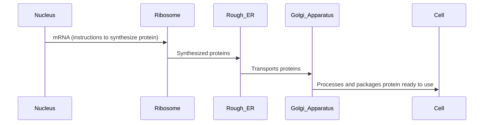


  
   
  *Golgi stack.*
  
  
  
  *Golgi apparatus in red outline*
  
  
  
  *3D rendering of Golgi Apparatus.*
  


**NAME**: Golgi Apparatus  

**CHARACTERISTICS**:
- Stack of parallel flattened sacs  
- Single membrane coating  
- Vesicles bud off from one end  

**FUNCTION**:
- Processes proteins and carbohydrates  
- Modifies and packages chemicals  
- Transports glycoproteins  

**Function between Nucleus, ER, Ribosome & Golgi Apparatus**:
