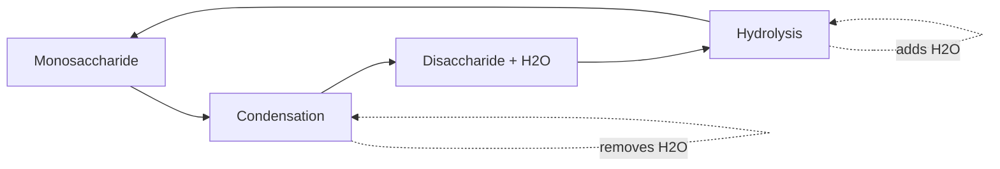

# Disaccharide Formation & Breakdown [4.2.3, 4.2.4]

## NAME
**Condensation and Hydrolysis** - reversible reactions forming and breaking disaccharides

## CHARACTERISTICS
- **Condensation** removes water to join monosaccharides
- **Hydrolysis** adds water to break disaccharides apart  
- **Glycosidic bonds** form between carbon atoms of sugars
- **Reversible process** under appropriate conditions

## FUNCTION
- **Energy storage** - condensation stores energy in chemical bonds
- **Energy release** - hydrolysis releases stored energy
- **Metabolic control** - enzymes regulate these reactions
- **Digestive process** - breakdown of dietary carbohydrates

## Word Equations

### Formation (Condensation)

{}

### Maltose Formation
**Glucose + Glucose → Maltose + Water**

### Sucrose Formation  
**Glucose + Fructose → Sucrose + Water**

### Lactose Formation
**Glucose + Galactose → Lactose + Water**
{}

### Breakdown (Hydrolysis)

{}

### Maltose Breakdown
**Maltose + Water → Glucose + Glucose**

### Sucrose Breakdown
**Sucrose + Water → Glucose + Fructose**

### Lactose Breakdown  
**Lactose + Water → Glucose + Galactose**
{}

