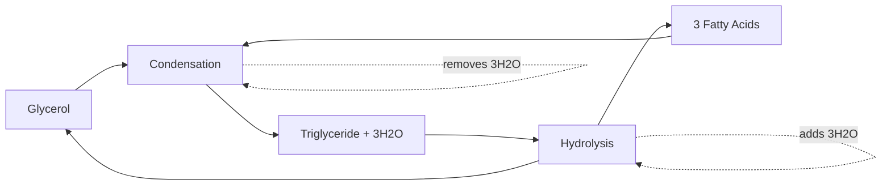

# Triglyceride Formation & Breakdown [4.4.3, 4.4.4]

## NAME
**Triglyceride synthesis and hydrolysis** - formation and breakdown of fat molecules

## CHARACTERISTICS
- **Condensation reaction** forms triglycerides from glycerol and fatty acids
- **Hydrolysis reaction** breaks triglycerides back to components
- **Three water molecules** involved in each complete reaction
- **Ester bonds** link fatty acids to glycerol backbone

## FUNCTION
- **Energy storage** - condense excess nutrients into compact fat stores
- **Energy mobilization** - hydrolyze fats to release fatty acids for fuel
- **Metabolic flexibility** - store energy when abundant, release when needed
- **Cellular signaling** - fatty acids serve as signaling molecules

## Word Equations

### Formation (Condensation)
{}

### Triglyceride Synthesis
**Glycerol + 3 Fatty acids → Triglyceride + 3 H₂O**

### Energy Investment
Condensation requires energy input to form ester bonds
{}

### Breakdown (Hydrolysis)
{}

### Triglyceride Breakdown  
**Triglyceride + 3 H₂O → Glycerol + 3 Fatty acids**

### Energy Release
Hydrolysis releases stored chemical energy for cellular use

{}


The ethanol emulsion test can detect lipids - when lipids are mixed with ethanol then water, a white emulsion forms indicating lipid presence.

✅ Quick Check: How many water molecules are removed when forming one triglyceride?
💡 Real Example: During fasting, hormone-sensitive lipase breaks down stored triglycerides in fat cells to provide fatty acids for energy.