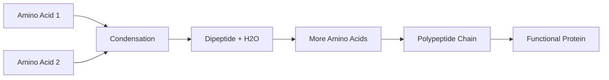

# Amino Acids & Peptide Formation [4.3.2]

## NAME
**Amino acids** - protein monomers that link together to form polypeptides

## CHARACTERISTICS
- **Basic building blocks** of all proteins
- **20 different types** of amino acids in living organisms
- Each has an **amino group, carboxyl group, and variable side chain**
- **Monomers** that combine through condensation reactions

## FUNCTION
- **Protein synthesis** - combine in specific sequences to form proteins
- **Peptide bond formation** - link through condensation reactions
- **Structural diversity** - different side chains create protein variety
- **Metabolic building blocks** - can be recycled and reused

## Formation Process
{}
### Dipeptide Formation
Two amino acids join through condensation, removing one water molecule

### Polypeptide Chain
Continued condensation links 50-1000+ amino acids in sequence

### Protein Structure
Polypeptide chains fold into functional three-dimensional shapes
{}


Show Image
Amino group, carboxyl group, and variable R-group side chain
Show Image
Condensation reaction forming peptide bond between two amino acids


The sequence of amino acids determines protein function - even changing one amino acid can alter or destroy protein activity.

✅ Quick Check: How many different amino acids are commonly found in proteins?
💡 Real Example: Sickle cell anemia results from just one amino acid change in hemoglobin - glutamic acid is replaced by valine.