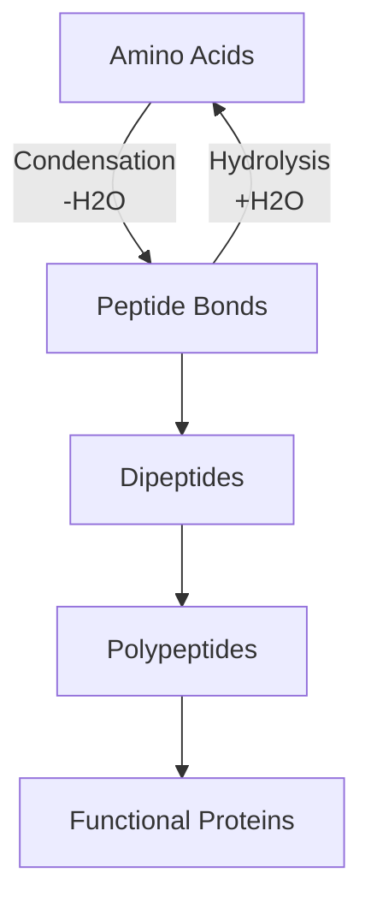

# Peptide Bond Formation & Breakdown [4.3.3]

## NAME
**Peptide bond reactions** - condensation and hydrolysis reactions involving amino acids

## CHARACTERISTICS
- **Condensation** removes water to form peptide bonds
- **Hydrolysis** adds water to break peptide bonds
- **Reversible process** under appropriate enzyme conditions
- **Energy-requiring** formation, energy-releasing breakdown

## FUNCTION
- **Protein synthesis** - build new proteins through condensation
- **Protein digestion** - break down proteins through hydrolysis
- **Cellular recycling** - amino acids can be reused
- **Metabolic regulation** - control protein levels in cells

## Word Equations

### Formation (Condensation)

{}

### Dipeptide Formation
**Amino acid + Amino acid → Dipeptide + Water**

### Extended Chain Formation
**Dipeptide + Amino acid → Tripeptide + Water**
{}

### Breakdown (Hydrolysis)  

{}

### Dipeptide Breakdown
**Dipeptide + Water → Amino acid + Amino acid**

### Polypeptide Breakdown
**Polypeptide + Water → Individual amino acids**
{}


Digestive enzymes like pepsin and trypsin catalyze hydrolysis reactions to break down dietary proteins into amino acids for absorption.

✅ Quick Check: What is removed during peptide bond formation?
💡 Real Example: During protein digestion in your stomach, pepsin breaks down meat proteins into smaller peptides through hydrolysis reactions.