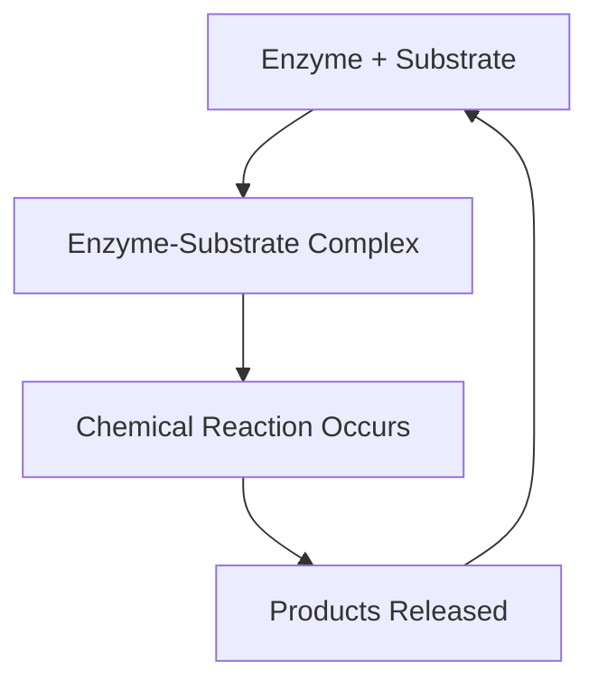

# The Process of Enzyme Action: Lock and Key Hypothesis [5.2.6]

## What's the Goal?
To explain how enzymes achieve their remarkable specificity and efficiency in catalyzing biochemical reactions through complementary molecular shapes.

## The Breakdown
{}
### Step 1: Substrate Recognition
The specific substrate molecule approaches the enzyme, which has a three-dimensional active site with a configuration that complements the substrate's shape.

### Step 2: Complex Formation
The substrate binds precisely to the active site, forming an enzyme-substrate complex, much like a key fitting into its specific lock.

### Step 3: Reaction Catalysis
The enzyme facilitates the chemical reaction, converting the substrate into products while remaining structurally unchanged.

### Step 4: Product Release
The products are released from the active site, and the enzyme returns to its original state, ready to catalyze another reaction.
{}

## Visual Summary

✅ Quick Check: Why can't just any substrate bind to any enzyme?
💡 Real-World Link: This specificity is why lactose-intolerant people can't digest milk - they lack the specific "key" (lactase enzyme) for the "lock" (lactose substrate).