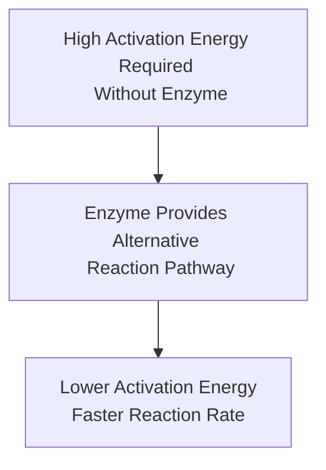

# Effect of Enzymes on Activation Energy [5.2.7]

## The Scenario (The 'If')
Most biochemical reactions in cells require high activation energy - the initial energy needed to break bonds in substrate molecules before reactions can proceed.

## The Biological Mechanism (The 'How')
Enzymes provide an alternative reaction pathway that requires significantly less activation energy. They stabilize the transition state and make bond breaking and formation easier to achieve.

## The Result (The 'Then')
The rate of biochemical reactions is dramatically accelerated, allowing cellular processes to occur at speeds compatible with life. Reactions that would take hours or days without enzymes can occur in milliseconds.

## Visual Flow

✅ Quick Check: What would happen to cellular metabolism if enzymes couldn't lower activation energy?
💡 Real-World Application: This principle is used in industrial processes - enzymes in laundry detergents work at lower temperatures than traditional chemical catalysts, saving energy.