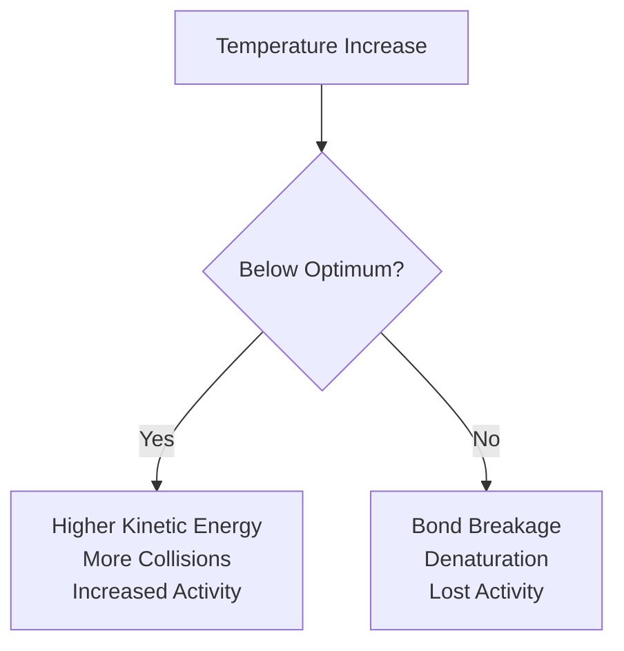

[5.2.8-1]

## The Scenario (The 'If')
Temperature changes occur in the environment where enzymes operate, affecting molecular motion and enzyme structure.

## The Biological Mechanism (The 'How')
**Low Temperature**: Reduced kinetic energy leads to fewer molecular collisions between enzymes and substrates, slowing reaction rates.

**Optimal Temperature**: Maximum kinetic energy for effective collisions occurs at around 37°C for human enzymes, doubling reaction rate for every 10°C increase up to this point.

**High Temperature**: Excessive heat breaks chemical bonds in enzyme molecules, causing denaturation and loss of three-dimensional structure. The active site changes shape, preventing substrate binding.

## The Result (The 'Then')
Enzyme activity follows a predictable pattern: gradual increase to optimal temperature (37°C for humans), then rapid decline to zero activity at around 60°C due to complete denaturation.

## Visual Flow

✅ Quick Check: Why do you get a fever when fighting infection, and why is a very high fever dangerous?
💡 Real-World Application: Food preservation relies on this principle - refrigeration slows enzyme activity in bacteria, while cooking denatures enzymes completely.