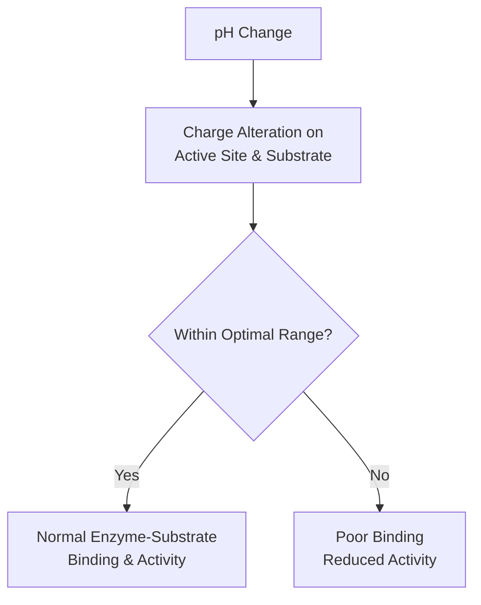

[5.2.8-2]

## The Scenario (The 'If')
The pH of the solution surrounding an enzyme changes, altering the concentration of hydrogen ions (H+) in the environment.

## The Biological Mechanism (The 'How')
pH changes alter the electrical charges on both the enzyme's active site and the substrate surface. This disrupts the precise molecular interactions needed for enzyme-substrate complex formation. At optimal pH, charges are perfectly balanced for maximum binding efficiency.

## The Result (The 'Then')
Each enzyme has a specific optimal pH range where it functions best. Outside this range, activity decreases and can be restored if pH returns to optimal levels. Extreme pH changes cause permanent denaturation.

**Enzyme-Specific Examples:**
- **Pepsin**: Optimal pH 1.5-2.5 (stomach acid environment)
- **Salivary Amylase**: Optimal pH 6.8 (mouth environment)  
- **Trypsin**: Optimal pH 8.5 (alkaline duodenum environment)

## Visual Flow

✅ Quick Check: Why do different digestive enzymes work in different parts of your digestive system?
💡 Real-World Application: Antacids can interfere with stomach enzyme function by changing pH, which is why they're taken between meals rather than during digestion.