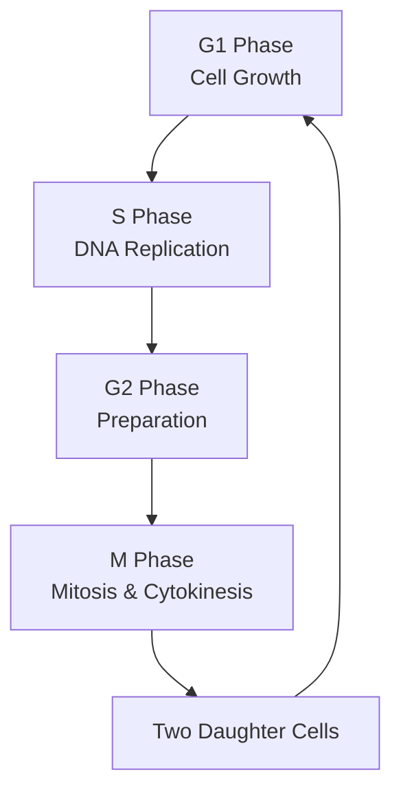

# The Process of Cell Cycle [6.2.1]

## What's the Goal?
The cell cycle ensures orderly DNA replication and cell division to produce two genetically identical daughter cells while maintaining proper cell growth and function.

## The Breakdown
{}
### Step 1: Interphase (Longest Phase)
The cell grows, replicates its DNA, and prepares for division. Consists of G1, S, and G2 phases.
### Step 2: M Phase (Mitotic Phase)
The cell undergoes nuclear division (mitosis) followed by cytoplasmic division (cytokinesis).
### Step 3: Return to G1
Newly formed daughter cells enter G1 phase to begin the cycle again.
{}

## Visual Summary


Show Image
Circular diagram showing all phases of the cell cycle.
Show Image
Relative time spent in each phase of the cycle.

✅ Quick Check: Which phase of the cell cycle takes the longest time?
💡 Real-World Link: Cancer occurs when cells lose control of their cell cycle, dividing uncontrollably instead of following normal checkpoints.