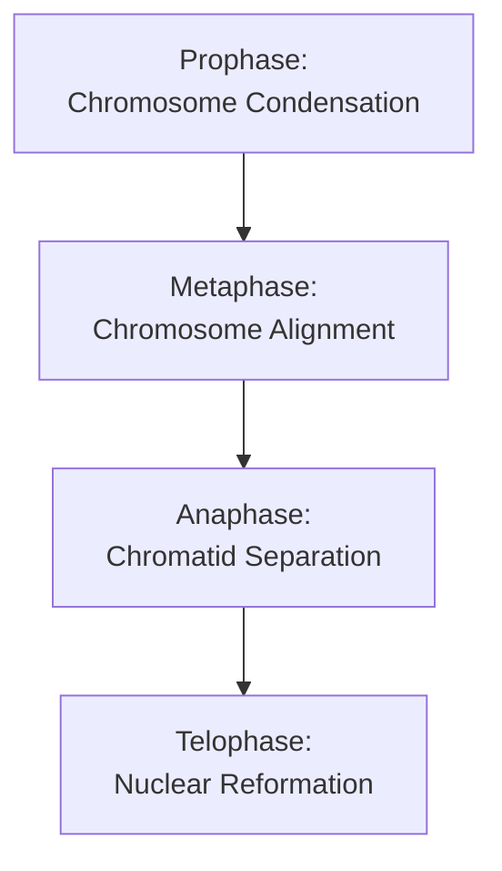

# The Process of Mitosis [6.2.2-6.2.3]

## What's the Goal?
Mitosis ensures equal distribution of genetic material to two daughter nuclei, maintaining the diploid chromosome number in each new cell.

## The Breakdown

{}

### Step 1: Prophase
Chromatin condenses into visible chromosomes (sister chromatids joined at centromere). Nuclear membrane breaks down, centrioles move to opposite poles, spindle fibers form.
### Step 2: Metaphase
Chromosomes align at the equatorial plane. Spindle fibers from opposite poles attach to each sister chromatid at the centromere.
### Step 3: Anaphase
Centromeres divide, sister chromatids separate and move to opposite poles as spindle fibers contract. Each chromatid is now an individual chromosome.
### Step 4: Telophase
Chromosomes decondense back to chromatin. Nuclear membranes reform around each set of chromosomes. Spindle fibers disappear.

{}

## Visual Summary


Show Image
Sequential diagram showing all four stages of mitosis.
Show Image
Actual micrograph of mitosis in plant root tip cells.

✅ Quick Check: During which stage do sister chromatids actually separate?
💡 Real-World Link: The drug colchicine stops mitosis at metaphase by preventing spindle fiber function, which is why it's used to study chromosomes.