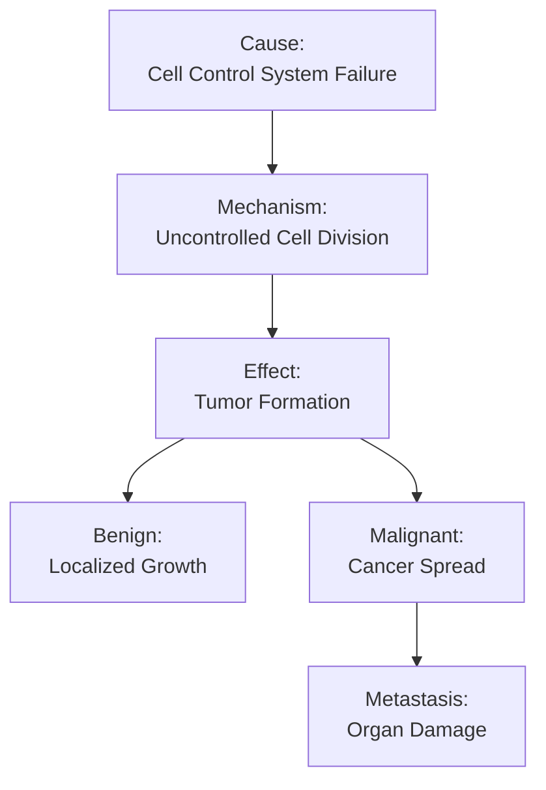

# Effect of Abnormal Mitosis on Human Health [6.4.1]

## The Scenario (The 'If')
When the cell cycle control system fails and cells lose their normal growth regulation, they begin dividing uncontrollably without responding to normal stop signals.

## The Biological Mechanism (The 'How')
Various factors (radiation, chemicals, carcinogens, genetic mutations, viruses) damage the cell's control mechanisms. These cells bypass normal checkpoints and continue dividing rapidly, competing for nutrients and space with healthy cells.

## The Result (The 'Then')
**Tumor Formation**: Mass of abnormally dividing cells
- **Benign tumor**: Localized, not dangerous, can be surgically removed
- **Malignant tumor (Cancer)**: Spreads to other tissues, destroys normal cells, disrupts organ function

**Cancer Progression**: Cancer cells invade lymph and blood vessels, spread to distant organs (metastasis), forming new tumors that can cause organ failure and death.

## Visual Flow


  
  *Four stages of breast cancer development and spread.*
   
  *Differences between benign and malignant tumors.*
  
  *Various factors that can cause abnormal mitosis.*


**Common causes of abnormal mitosis:**
- Radiation exposure (X-rays, gamma rays, UV rays)
- Chemical carcinogens (tobacco tar, formaldehyde, benzene)
- Genetic factors and inherited mutations
- Viral infections (HPV, hepatitis B)
- Environmental toxins

✅ **Quick Check**: What is the difference between a benign tumor and cancer?
💡 **Real-World Application**: Understanding cancer as uncontrolled mitosis explains why treatments like chemotherapy and radiation target rapidly dividing cells - they disrupt the cell cycle in cancer cells more than in normal cells.