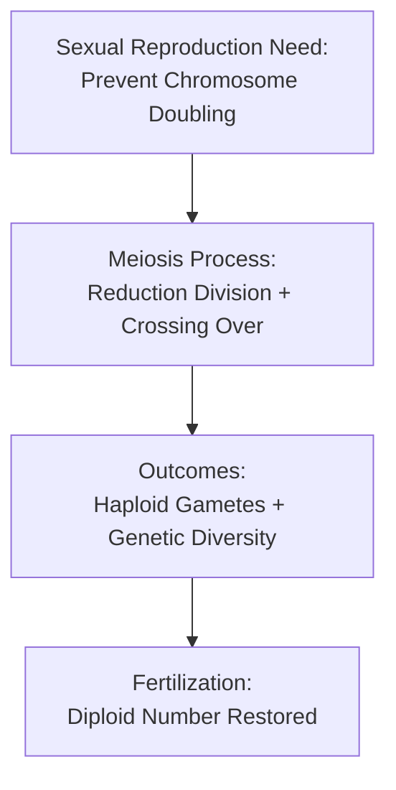

# Effect of Meiosis on Sexual Reproduction [6.3.3]

## The Scenario (The 'If')
Organisms that reproduce sexually need a mechanism to prevent chromosome doubling with each generation while creating genetic diversity.

## The Biological Mechanism (The 'How')
Meiosis reduces chromosome number by half and incorporates crossing over during prophase I, creating genetically unique haploid gametes through recombination and independent assortment.

## The Result (The 'Then')
Three critical outcomes are achieved:
- **Gamete Formation (Gametogenesis)**: Production of functional sperm and egg cells
- **Genetic Variation**: Each gamete receives a unique combination of genetic material
- **Chromosome Number Maintenance**: Diploid number restored when haploid gametes fuse during fertilization

## Visual Flow


  
  *Illustration showing chromosome number maintenance across generations.*
   
  *How crossing over creates genetic combinations.*
  
  *Complete cycle from diploid parents to diploid offspring.*


✅ **Quick Check**: What would happen to chromosome numbers if meiosis didn't occur before fertilization?
💡 **Real-World Application**: Genetic diversity from meiosis is crucial for species survival - it provides the variation needed for adaptation to environmental changes and disease resistance.