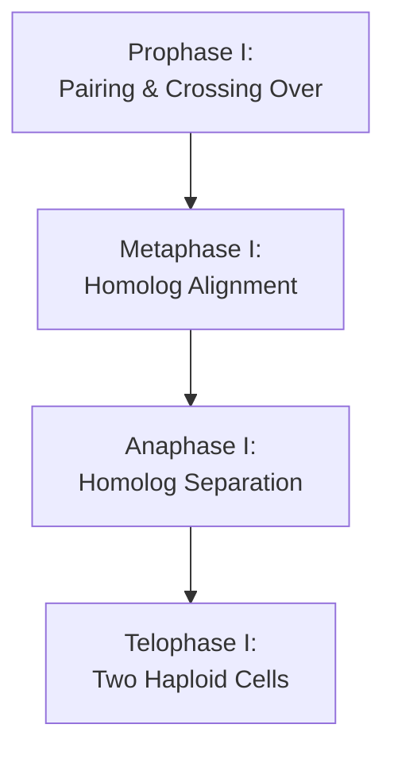

# The Process of Meiosis I [6.3.4-6.3.5]

## What's the Goal?
Meiosis I reduces chromosome number from diploid to haploid by separating homologous chromosome pairs while enabling genetic recombination through crossing over.

## The Breakdown

{}

### Step 1: Prophase I
Homologous chromosomes pair up (synapsis) forming bivalents. Crossing over occurs between non-identical chromatids at chiasma points. Nuclear membrane disappears, spindle fibers form.
### Step 2: Metaphase I
Homologous chromosome pairs align at equatorial plane. Spindle fibers attach to centromeres of each homolog from opposite poles.
### Step 3: Anaphase I
Homologous chromosomes separate and move to opposite poles. Sister chromatids remain joined at centromeres.
### Step 4: Telophase I
Chromosomes reach poles, nuclear membranes reform. Cytokinesis produces two haploid daughter cells. Brief interphase follows without DNA replication.

{}

## Visual Summary


  
  *Complete sequence of meiosis I stages.*
   
  *Detailed view of chiasma formation and genetic exchange.*
  
  *How homologous chromosomes separate in anaphase I.*


✅ **Quick Check**: What makes prophase I unique compared to prophase in mitosis?
💡 **Real-World Link**: Crossing over in prophase I is why siblings (except identical twins) are genetically unique - they inherit different combinations of parental chromosomes.