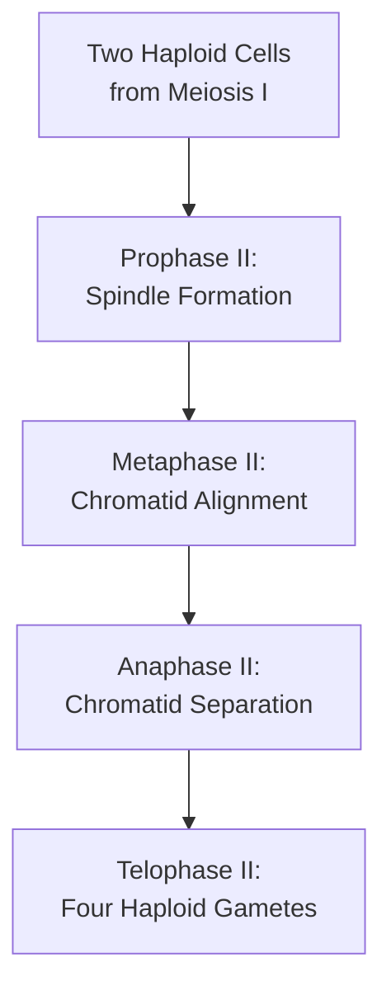

# The Process of Meiosis II [6.3.4-6.3.5]

## What's the Goal?
Meiosis II separates sister chromatids in each haploid cell from meiosis I, similar to mitosis but starting with haploid rather than diploid cells.

## The Breakdown

{}

### Step 1: Prophase II
Nuclear membranes disappear in both daughter cells. Chromosomes (still as sister chromatids) become visible. New spindle fibers form in each cell.
### Step 2: Metaphase II
Chromosomes align randomly at equatorial plane in each daughter cell. Spindle fibers attach to centromeres of sister chromatids.
### Step 3: Anaphase II
Centromeres divide, sister chromatids separate and move to opposite poles. Each chromatid is now considered an individual chromosome.
### Step 4: Telophase II
Chromosomes reach poles, nuclear membranes reform. Spindle fibers disappear. Cytokinesis produces four haploid gametes from the original diploid cell.

{}

## Visual Summary


  
  *Sequential stages of meiosis II in both daughter cells.*
   
  *Final result: four genetically unique haploid cells.*
  
  *Overview of both meiosis I and II together.*


✅ **Quick Check**: How many cells result from one complete meiosis, and what is their chromosome condition?
💡 **Real-World Link**: In human males, all four cells from meiosis become functional sperm, but in females, only one becomes an egg while the others become polar bodies that eventually degenerate.