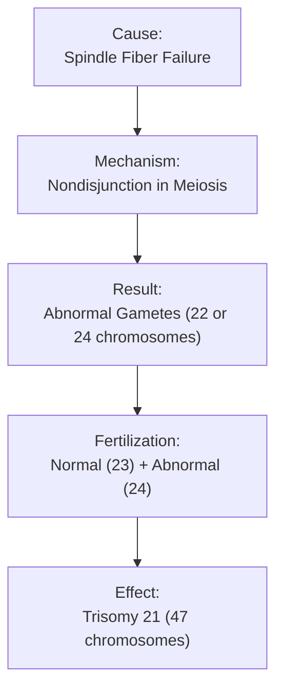

# Effect of Abnormal Meiosis on Down Syndrome [6.4.2]

## The Scenario (The 'If')
During meiosis (usually meiosis I), spindle fibers fail to function properly during anaphase, preventing the normal separation of homologous chromosomes or sister chromatids.

## The Biological Mechanism (The 'How')
**Nondisjunction** occurs when chromosomes fail to separate properly. This creates gametes with abnormal chromosome numbers:
- One gamete receives an extra chromosome (24 instead of 23)
- The other gamete is missing a chromosome (22 instead of 23)

When the abnormal gamete (24 chromosomes) fuses with a normal gamete (23 chromosomes) during fertilization, the resulting zygote has 47 chromosomes instead of the normal 46.

## The Result (The 'Then')
**Trisomy 21 (Down Syndrome)**: Individual has three copies of chromosome 21 instead of two.

**Characteristics include:**
- Mental retardation and developmental delays
- Distinctive facial features (slanted eyes, protruding tongue)
- Stunted physical growth
- Increased risk of heart defects and other health issues

## Visual Flow


  
  *How chromosome separation failure leads to abnormal gametes.*
   
  *Chromosome analysis showing extra chromosome 21.*
  
  *Child with Down syndrome showing characteristic features.*


**Key Facts:**
- Down syndrome occurs in about 1 in 700 births
- Risk increases with maternal age, especially over 35
- Most common chromosomal disorder
- Individuals can lead fulfilling lives with proper support

✅ **Quick Check**: How many total chromosomes does a person with Down syndrome have?
💡 **Real-World Application**: Prenatal screening tests like amniocentesis can detect chromosomal abnormalities by examining fetal cells, helping families prepare for special needs or make informed decisions.